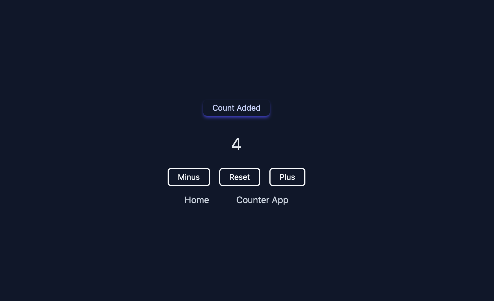

# NextJS Counter App

> Nextjs App built to practice using Nextjs, routing, redux inside of next & tailwind for styling.
> Live demo [_here_](https://nextjs-counter-bg.netlify.app).

## Table of Contents

- [NextJS Counter App](#nextjs-counter-app)
  - [Table of Contents](#table-of-contents)
  - [General Information](#general-information)
  - [Technologies Used](#technologies-used)
  - [Screenshots](#screenshots)
  - [Setup](#setup)
  - [Project Status](#project-status)
  - [Contact](#contact)
  <!-- * [License](#license) -->

## General Information

- Built to practice using different skills.
- Wanted to explore the ways Nextjs handles routing, and setting up redux toolkit. Also wanted to get more familiar with using the Tailwindcss library.

## Technologies Used

- React
- NextJS
- Redux Toolkit
- Tailwindcss

## Screenshots



## Setup

All you will have to do is clone the repo, run npm install, and then spin up the dev server.

Clone Repo:

```
git clone https://github.com/BrandonGormley/nextjs-counter.git
```

Run NPM Install to install all packages needed:

(cd into directory if not done already)

```
npm install
```

Boot up nextjs dev server:

```
npm run dev
```

## Project Status

Project is: _complete_.

This was built for practice reasons only.

## Contact

Created by [@BrandonGormley](https://github.com/BrandonGormley)
